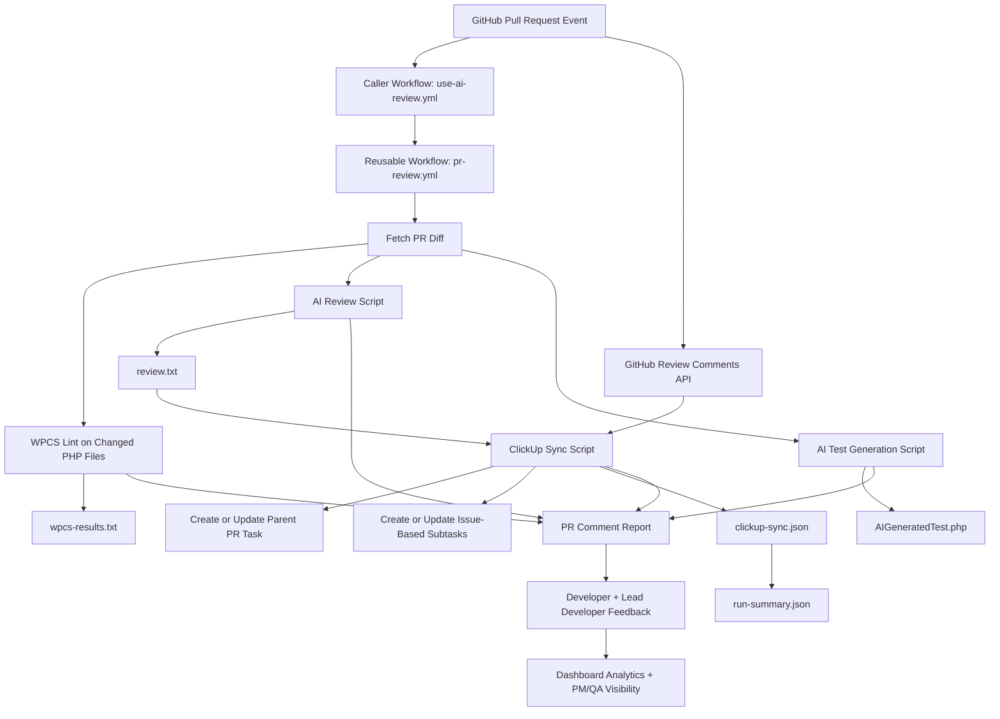

# DevOps Intelligence Layer Architecture and Data Flow

## Event-Driven Paradigm

This solution uses an event-driven model triggered by GitHub Pull Request events. Each PR event starts an automated pipeline that runs static analysis, AI review, AI test generation, and ClickUp synchronization.

## System Components

- GitHub PR trigger in caller repository workflow
- Reusable DevOps Intelligence workflow
- AI review engine for PR diff analysis
- AI PHPUnit test generation engine
- WPCS linting stage
- ClickUp integration stage for parent task and issue-based subtasks
- GitHub review-comment ingestion stage for raw code review discussion sync
- Idempotent ClickUp mapping and update stage for repeated PR events
- PR comment reporting stage for developer and lead visibility
- Evidence artifact generation stage (run summary JSON + logs)
- Dashboard for trend visualization and stakeholder insights

## End-to-End Data Flow

## ClickUp Endpoint Mapping

- POST /api/v2/list/{list_id}/task
  - Parent task for PR context
  - Subtasks for each parsed review issue using parent field
- POST /api/v2/task/{task_id}/comment
  - Optional threaded commentary for additional review context

## Dashboard Data Mapping Summary

- PR theme recurrence from parsed issue classes
- Comment type distribution from review conversation density
- Activity trends from PR and review throughput over selected ranges
- Stakeholder cards focused on Developers, Lead Developers, PMs, and QA

## Design Rationale

- Event-driven trigger minimizes manual intervention and supports continuous feedback.
- Reusable workflow enables multi-repository adoption.
- Structured outputs (review.txt, wpcs-results.txt, generated tests) provide auditable artifacts for assessment evidence.
- ClickUp sync closes the loop between code review and delivery tracking.
- Idempotent PR mapping avoids duplicate parent tasks during synchronize/reopened events.
- Strict/soft WPCS mode allows policy control between advisory linting and hard quality gates.
